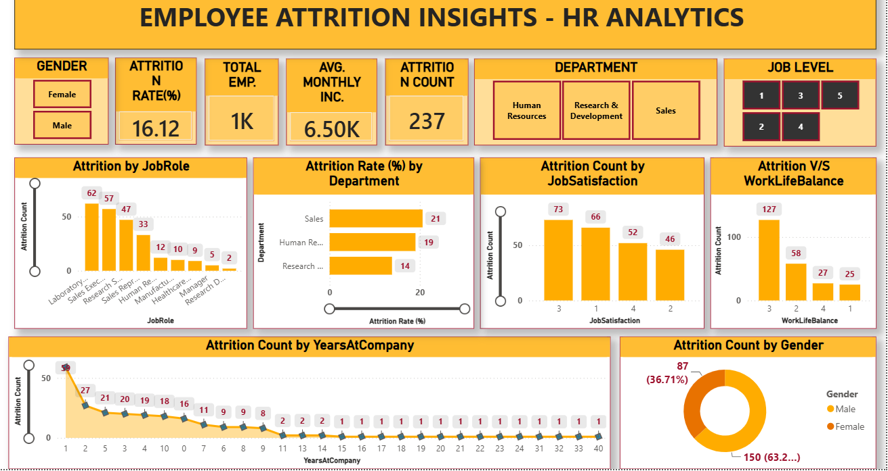

# 👥 HR Employee Attrition Analytics Dashboard

[](https://app.powerbi.com/)
[](https://github.com/Vanshiv18)

## 🔗 Live Power BI Dashboard

👉 **[Open the Interactive HR Attrition Dashboard](https://app.powerbi.com/view?r=eyJrIjoiMDE0Y2I4YzctZWIwYy00YjkzLWJlMTktYjYwNjIzMGViZTM3IiwidCI6ImUxNGU3M2ViLTUyNTEtNDM4OC04ZDY3LThmOWYyZTJkNWE0NiIsImMiOjEwfQ%3D%3D)**
## 📸 Dashboard Preview


---

## 📌 Project Overview

The **HR Employee Attrition Analytics Dashboard** is an interactive Microsoft Power BI project developed to examine employee attrition patterns and identify workforce-related trends.

The dashboard presents employee attrition insights across dimensions such as **years at company, job role, job satisfaction, and employee-related characteristics**. It converts HR data into visual insights that can support workforce planning, employee retention initiatives, and evidence-based HR decision-making.

## 🎯 Project Objectives

- Monitor employee attrition through interactive HR KPIs.
- Analyze attrition patterns across tenure and job roles.
- Examine the relationship between job satisfaction and employee attrition.
- Identify workforce segments that may require further HR investigation.
- Present insights through an interactive dashboard for management reporting.

## 📊 Dashboard Analysis

### 1. Employee Attrition Overview

The dashboard provides an executive-level view of employee attrition and supports the monitoring of workforce trends through summary indicators and visual reporting.

### 2. Attrition by Years at Company

Analyzes how employee attrition varies across different tenure levels. This can help HR teams examine retention patterns among new employees and long-serving employees.

### 3. Attrition by Job Role

Compares attrition counts across different job roles to highlight role-wise differences and identify areas for deeper workforce analysis.

### 4. Job Satisfaction and Attrition

Examines attrition counts across job satisfaction levels. This supports analysis of employee experience, engagement, and potential retention concerns.

### 5. Interactive Filtering

Power BI visuals and filters enable users to explore the data dynamically and examine specific employee segments.

## 🔍 Key Business Questions

- Which tenure groups show higher employee attrition?
- How does attrition vary across different job roles?
- What patterns appear across job satisfaction levels?
- Which employee segments may need further retention analysis?
- How can HR teams use data to support employee engagement and workforce planning?

## 🧠 Analytical Workflow

```text
HR Employee Dataset
        ↓
Data Preparation
        ↓
Data Modelling
        ↓
DAX Measures / KPI Creation
        ↓
Attrition Analysis
        ↓
Interactive Power BI Visuals
        ↓
HR Insights & Decision Support
```

## 🛠️ Tools and Skills

| Area | Tools / Skills |
|---|---|
| Business Intelligence | Microsoft Power BI |
| Data Transformation | Power Query |
| Calculations | DAX |
| HR Analytics | Attrition Analysis, Employee Retention, Workforce Insights |
| Reporting | KPI Tracking, Interactive Dashboards |
| Analysis Dimensions | Job Role, Years at Company, Job Satisfaction |
| Visualization | Charts, Cards, Filters, Interactive Reports |

## 💼 Business Value

This dashboard demonstrates how HR analytics can support:

- Employee retention analysis
- Workforce planning
- Job-role level monitoring
- Employee experience analysis
- Management reporting
- Data-driven HR decision-making

The dashboard is intended to help HR stakeholders identify patterns that can be explored further through employee engagement initiatives, retention strategies, and targeted workforce analysis.

## 📁 Suggested Repository Structure

```text
HR-Attrition-PowerBI-Dashboard/
│
├── README.md
├── dashboard/
│   └── HR_Attrition_Dashboard.pbix
├── dataset/
│   └── HR_Employee_Attrition_Dataset.csv
└── images/
    └── dashboard_preview.png
```

## 🔮 Future Enhancements

- Add attrition rate by department and business unit.
- Include overtime, income, work-life balance, and satisfaction analysis where data is available.
- Add employee segmentation and risk-based retention indicators.
- Include year-wise trend analysis.
- Add drill-through pages for detailed employee segments.
- Introduce automated refresh and scheduled reporting.
- Add an executive HR summary page with actionable recommendations.

## ⚠️ Limitations

- Dashboard findings depend on the quality and coverage of the underlying dataset.
- Relationships observed in the dashboard should not automatically be interpreted as causal relationships.
- Additional HR context and qualitative employee feedback may be required before implementing retention actions.

## 👤 Author

**Vanshiv Rana**  
MBA — Data Science & Artificial Intelligence | B.Tech — Civil Engineering

🔗 [GitHub Profile](https://github.com/Vanshiv18)

---

⭐ If you find this project useful, consider starring the repository.
